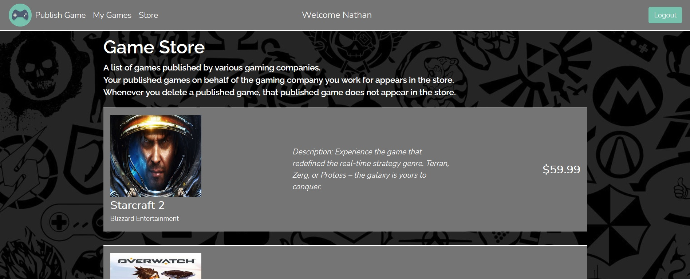

# GameHub

This repository is for project 3 and the final project for the CS5610 Web Development Course (updated README for final project).
You can check the code for the final project in the project4 branch.
Note: The code for the final project from the project4 branch has been merged into the main branch. 

## Project Objective

The objective of this project is to create a full-stack web application (using Node, Express, MongoDB, and React with Hooks) called GameHub that brings gamers and gaming companies together. There are two types of users/people that can use GameHub, gamers and gaming company publicists. Gamers are any users/people that have little to high interest in video games, and more importantly purchasing video games. GameHub serves as a simple e-commerce web app for registered gamers where they can view and add their video games from the game store, published by various gaming companies, to their cart for purchase. Gaming company publicists can use GameHub to publish and manage published video games under the name of the gaming company they work for. A gaming company publicist can simply publish a video game for the gaming company they work, see their personal list of published games, and remove any of their published games.   

## Author(s)

- Nathaniel Tesfalidet
- Yuanyuan Shen

## Relevant Links
- [Class website link](https://johnguerra.co/classes/webDevelopment_fall_2021/)
- [Public Demo video link](https://drive.google.com/file/d/1kTtQQTHYF4XbEp8SysMwFdi9p4dtNOQ7/view?usp=sharing)
- [Presentation video link](https://drive.google.com/file/d/1fN5n7BQlWVHbzqVOxkuG9-R4SfhQ2LRM/view?usp=sharing)
- [Google slides link](https://docs.google.com/presentation/d/1TRGKGfJ2ceX-pgnCyVp-XvWe8_KKmyiVWcP-NMTX414/edit?usp=sharing)

## Build Instructions
- Make sure to run `yarn install` in the root of repository and in the frontend folder to have all your node_modules depedencies.
- For running the backend portion of this project run `yarn start` in the root of repository.
- For running the frontend portion of this project run `yarn start` in the frontend folder.
- For building the frontend portion of this project run `yarn build` in the frontend folder.

## Frontend structure
- All of the UI implementations are done in react.
- Implementations of the login page, registration page, gaming company pages, and gamer pages are under frontend/src/pages.
- Implementations of the components, for the gaming company and gamer pages are under frontend/src/components. 

## Backend structure
- The database directory (under the root of repository) contains all database CRUD operations for login, registration, gaming company and gamer backend functionalities.
- The routes directory contain all the server-side routes for supporting all database CRUD operations for login, registration, gaming company and gamer backend functionalities. 

## Division of Work
### Nathaniel
- Login (UI, CRUD operations, and routes for login page)
- Gaming Company (UI, CRUD operations, and routes for gaming company pages) 

### Yuanyuan
- Registration(UI, CRUD operations, and routes for register page)
- Gamer (UI, CRUD operations, and routes for gamer pages)

## Screenshots (updated)
Login Page

Registration Page

Gamer Store Page

Gamer Cart Page

Gaming company publicist Publish Game Page

Gaming company publicist My Games Page

Gaming company publicist Store Page

