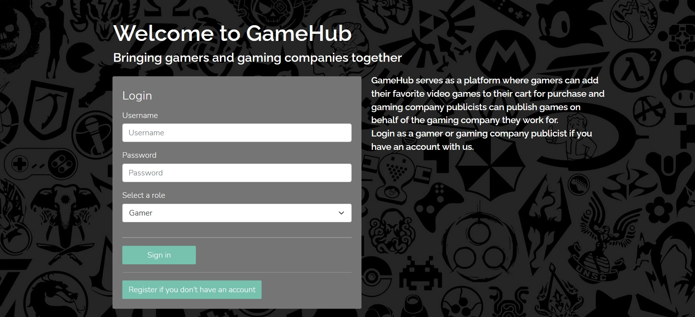
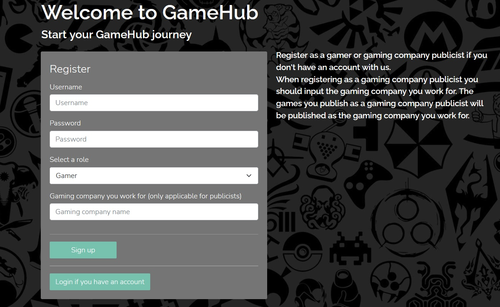
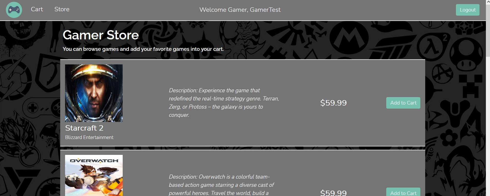
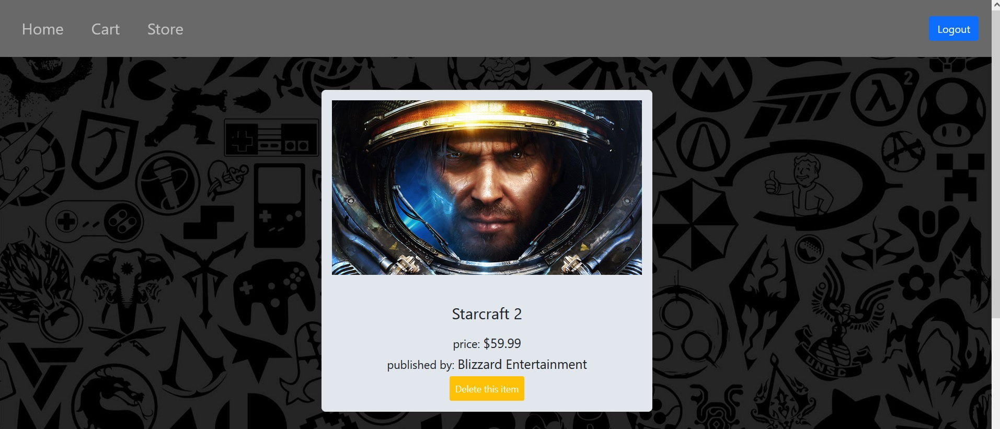
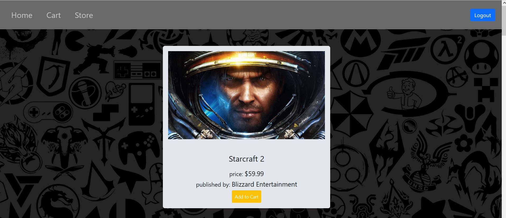
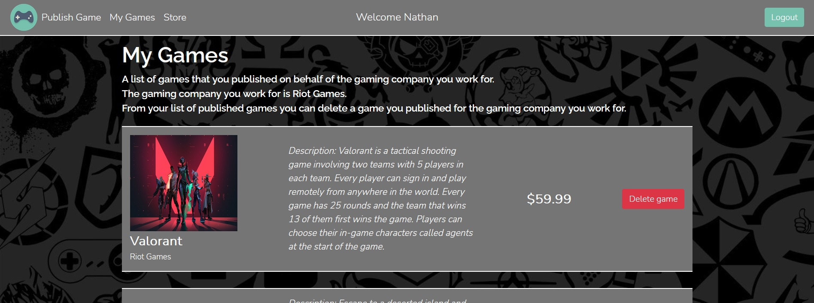

# GameHub

This repository is for Project 3 for the CS5610 Web Development Course.

## Project Objective

The objective of this project is to create a full-stack web application (using Node, Express, MongoDB, and React with Hooks) called GameHub that brings gamers and gaming companies together. GameHub serves as a simple e-commerce web app where registered gamers can view video games, published by registered gaming companies, from the game store and add their favorite video games from the game store into their cart. Gamers also have the option to remove certain video games from their cart. GameHub allows registered gaming companies to publish their video games. After a gaming company publishes their game, they can view their published game from their personal list (MyGames) and from the game store. A gaming company can also have the option to remove their published game from their personal list which would update the game store.  

## Author(s)

- Nathaniel Tesfalidet
- Yuanyuan Shen

## Relevant Links
- [Class website link](https://johnguerra.co/classes/webDevelopment_fall_2021/)
- [Video demo link](https://drive.google.com/file/d/1EqrR9VoNFhEyjwyaxW_WUQ7wSPgvu8CL/view?usp=sharing)
- [Google slides link](https://docs.google.com/presentation/d/1sDh6wsXc9jFuNWVp8kkjJSccw-4F1YPAc6rU9krnK0w/edit?usp=sharing)

## Build Instructions
- Make sure to run `yarn install` in the root of repository and in the frontend folder to have all your node_modules depedencies.
- For running the backend portion of this project run `yarn start` in the root of repository.
- For running the frontend portion of this project run `yarn start` in the frontend folder.
- For building the frontend portion of this project run `yarn build` in the frontend folder.

## Frontend structure
- All of the UI implementations are done in react.
- Implementations of the login page, registration page, gaming company pages, and gamer pages are under frontend/src/pages.
- Implementations of the components, for the gaming company and gamer pages are under frontend/src/components. 

## Backend structure
- The database directory (under the root of repository) contains all database CRUD operations for login, registration, gaming company and gamer backend functionalities.
- The routes directory contain all the server-side routes for supporting all database CRUD operations for login, registration, gaming company and gamer backend functionalities. 

## Division of Work
### Nathaniel
- Login (UI, CRUD operations, and routes for login page)
- Gaming Company (UI, CRUD operations, and routes for gaming company pages) 

### Yuanyuan
- Registration(UI, CRUD operations, and routes for register page)
- Gamer (UI, CRUD operations, and routes for gamer pages)

## Screenshots
Login Page

Registration Page

Main Gamer Page

Gamer Cart Page

Gamer Store Page

Gaming company Store Page

Gaming company My Games Page

